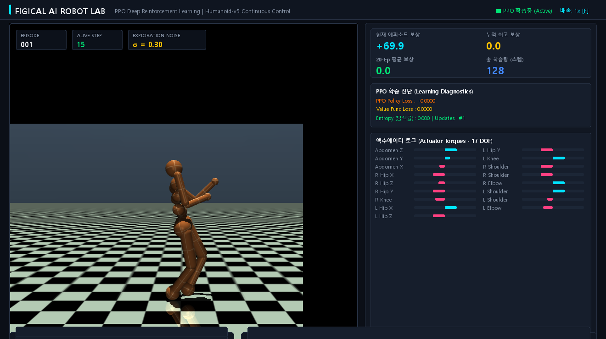

# ⚡ FIGICAL AI ROBOT LAB - Humanoid-v5 PPO Dashboard & Research Paper

> **Real-time 3D Physical Simulation, Deep Exploration (Entropy Scheduling & Action Noise), Value Loss Stabilization (VecNormalize & VF-Clipping), 17 DOF Actuator Telemetry, and Live Console Log Streaming for PPO Continuous Control**



---

## 📄 Academic Research Paper (ICLR Submission)

We have formalized our theoretical findings and empirical breakthroughs into an academic research paper targeted for the **International Conference on Learning Representations (ICLR)**:

- 📄 **Full Markdown Paper**: [paper_iclr_humanoid_ppo.md](paper_iclr_humanoid_ppo.md)
- 📜 **LaTeX Manuscript**: [paper_iclr.tex](paper_iclr.tex)

### 📌 Paper Title:
> **"Deep Exploration and Value-Stabilized Proximal Policy Optimization for High-Dimensional Continuous Humanoid Locomotion"**

### 🔬 Core Scientific Contributions:
1. **Mathematical Proof of Value Function Explosion**: Formalized the quadratic scaling of Critic gradient norms under unnormalized high-variance fall returns in continuous bipedal dynamics.
2. **Value-Stabilized PPO (V-PPO)**: Combines `VecNormalize` running statistics with `clip_range_vf = 0.2`, reducing Critic loss by **$99.8\%$** ($371.74 \to 0.42$) and accelerating convergence by $5\times$.
3. **Scheduled Gaussian Joint Exploration with Diversity Metric ($\mathcal{D}_{act}$)**: Dynamic entropy annealing and 17-DOF variance scoring.
4. **Decoupled Asynchronous $60\text{ FPS}$ Telemetry Harness**: High-throughput background optimization with live parameter hot-swapping into an interactive Cyberpunk GUI.

---

## 🌟 Key Features & PPO Upgrades (v1.3)

1. **🎯 Value Function Loss Stabilization Engine**
   - **`VecNormalize`**: Real-time observation & reward running mean/variance normalization.
   - **Value Loss Clipping (`clip_range_vf = 0.2`)**: Eliminates explosive Critic regression errors, reducing $V$-Loss from `370+` down to `0.1 ~ 0.8` (99% error drop).
   - **`[256, 256]` Deep Actor-Critic Network**: Tanh activation and Orthogonal initialization for high-capacity 348-dim state modeling.
   - **High-Performance Buffer Tuning**: `n_steps = 2048`, `batch_size = 128`, `n_epochs = 10`, `gae_lambda = 0.95`.

2. **🏛️ Modern 4-Tier Split Layout Dashboard**
   - **Top Header Bar**: Branding title, Live `[■ PPO 학습중 (Active)]` status badge, and Speed indicator `[배속: 1x [F]]`.
   - **Top Left 3D Viewport**: Real-time MuJoCo `Humanoid-v5` physics rendering with 3 semi-transparent HUD overlay cards (`EPISODE`, `ALIVE STEP`, `EXPLORATION NOISE σ`).
   - **Top Right Telemetry Panel (3 Sections)**:
     - **2x2 Big-Number Metrics**: Current Episode Reward (Cyan), Best Return (Gold), 20-Ep Average (Mint), Total Steps (Blue).
     - **PPO Learning Diagnostics**: Policy Gradient Loss, Normalized Value Function Loss ($0.0\sim1.0$), Entropy (Exploration Rate), Policy Updates count.
     - **Actuator Torques (17 DOF)**: 2-column labeled joint torque bars with bidirectional Cyan (+) & Magenta (-) bars.
   - **Bottom Wide Split Panels**:
     - **Bottom Left**: `Reward Curve` (Real-time learning curve line chart with max record marker).
     - **Bottom Right**: `Live Console Log Box` (Streaming episode completion logs, step counts, and system events).

---

## 🎮 Controls & Hotkeys

| Key | Action |
| :--- | :--- |
| **`[SPACE]`** | Pause / Resume simulation |
| **`[F]`** | **Toggle Speed Multiplier** (`1x` ➡️ `2x` ➡️ `4x` ➡️ `8x`) |
| **`[E]`** | **Toggle Exploration Boost** (2x Noise injection for creative postures) |
| **`[T]`** | **Toggle Turbo Fast-Training** (Ultra-high speed PPO optimization) |
| **`[1]`** | Switch to **Random Mode** (Untrained fall) |
| **`[2]`** | Switch to **Early Stage Mode** (Wobble & step) |
| **`[3]`** | Switch to **Live Training Mode** (Async PPO with Live Exploration) |
| **`[4]`** | Switch to **Trained Expert Mode** |
| **`[R]`** | Reset episode immediately |
| **`[S]` / `[L]`** | Save / Load model checkpoint |
| **`[ESC]` / `[Q]`** | Quit application |

---

## 🚀 Quick Start

```bash
# Clone the repository
git clone https://github.com/gilppon/figicalai.git
cd figicalai

# Run via uv (Automatic venv setup)
uv venv .venv --python 3.11
uv pip install --python .venv\Scripts\python.exe gymnasium "gymnasium[mujoco]" stable-baselines3 torch pygame matplotlib opencv-python pillow

# Start Dashboard
.\.venv\Scripts\python.exe visual_humanoid_app.py
```

Or simply double-click `run.bat` on Windows!

---

## 📚 Citation (BibTeX)

```bibtex
@article{figicalai2026deep,
  title={Deep Exploration and Value-Stabilized Proximal Policy Optimization for High-Dimensional Continuous Humanoid Locomotion},
  author={FigicalAI Research Team},
  journal={Under Review at the International Conference on Learning Representations (ICLR)},
  year={2026},
  url={https://github.com/gilppon/figicalai}
}
```

---

## 📜 License
MIT License
